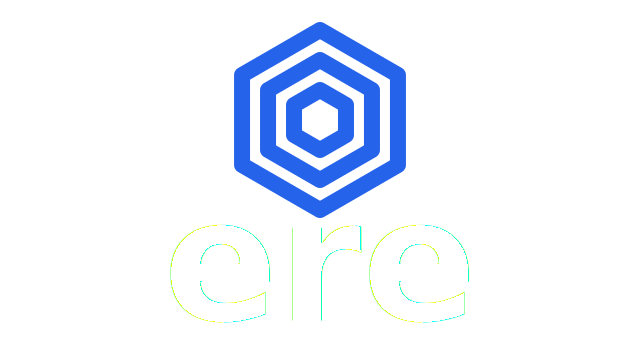

<p align="center">
  
</p>

<h1 align="center">Ere – Unified zkVM Interface & Toolkit</h1>

<p align="center">
  <b>Compile. Execute. Prove. Verify.</b><br/>
  One ergonomic Rust API, multiple zero‑knowledge virtual machines.
</p>

---

## Table of Contents

* [Features](#features)
* [Supported zkVMs](#supported-zkvms)
* [Quick Start](#quick-start)

  * [1. Install SDKs](#1-install-sdks)
  * [2. Add Dependencies](#2-add-dependencies)
  * [3. Compile & Prove Example](#3-compile--prove-example)
  * [4. Run the Test Suite](#4-run-the-test-suite)
* [Directory Layout](#directory-layout)
* [Architecture](#architecture)

  * [The Interface](#the-interface)
  * [Backend Crates](#backend-crates)
  * [Input Handling](#input-handling)
* [Contributing](#contributing)
* [Disclaimer](#disclaimer)
* [License](#license)

## Features

* **Unified Rust API** for compiling, executing, proving & verifying zkVM programs
* **Pluggable back‑ends** – easily switch between different zkVMs
* **SDK bootstrap scripts** for every supported zkVM
* **End‑to‑end test suite** covering compilation → proof → verification for each backend

## Supported zkVMs

- SP1
- OpenVM
- Risc Zero
- Jolt
- Pico
- Zisk

## Quick Start

This guide assumes you have Rust and Cargo installed. If not, please refer to the [Rust installation guide](https://www.rust-lang.org/tools/install).
Also, you must have Docker installed since some of the SDKs require it.

### 1. Install SDKs (if required)

All zkVMs but SP1 require you to install their SDKs, for example:
```bash
bash scripts/sdk_installers/install_jolt_sdk.sh
```

For SP1, guest program compilation uses Docker. With time more zkVMs will follow this patterns so installing SDKs
in the host machine isn't necessary.

### 2. Add Dependencies

```toml
# Cargo.toml
[dependencies]
zkvm-interface = { path = "crates/zkvm-interface" }
ere-sp1        = { path = "crates/ere-sp1" }
```

### 3. Compile & Prove Example

```rust
use zkvm_interface::{Compiler, zkVM, Input};
use ere_sp1::{EreSP1, RV32_IM_SUCCINCT_ZKVM_ELF};

let mount_directory = std::path::Path::new(".");
let guest_relative = std::path::Path::new("guest/hello");
let elf = RV32_IM_SUCCINCT_ZKVM_ELF::compile(mount_directory, guest_relative)?; // compile
let mut io = Input::new();
io.write(&42u32)?;
let zkvm = EreSP1::new(elf);
let (proof, _report) = zkvm.prove(&io)?;             // prove
zkvm.verify(&elf, &proof)?;                                // verify
```

### 4. Run the Test Suite

```bash
cargo test --workspace
```

> **Tip** Use the provided Dockerfiles for a ready‑made toolchain.

## Directory Layout

```
crates/
  zkvm-interface/     ← core traits & types
  ere-{backend}/      ← backend adapters (sp1, openvm, …)
tests/                ← guest programs & integration tests
scripts/sdk_installers/ ← SDK install helpers
docker/               ← Dockerfiles & build contexts
```

## Architecture

### The Interface

`zkvm-interface` exposes two core traits:

* **Compiler** – compile a guest project into the correct zkVM artifact. For most this will be a RISCV ELF binary or some type that wraps it and includes extra metadata such as a proving and verifying key.
* **zkVM** – execute, prove & verify that artifact

### Backend Crates

Each `ere-{backend}` crate implements the above traits for its zkVM.

### Input Handling

The `Input` type supports both chunked (`Vec<Vec<u8>>`) and contiguous (`Vec<u8>`) modes to satisfy differing backend APIs.

## Contributing

PRs and issues are welcome!

## Disclaimer

zkVMs evolve quickly; expect breaking changes. Although the API is generic, its primary target is **zkEVMs**, which may for example, guide the default set of precompiles.

## License

Licensed under either of

* MIT license (LICENSE‑MIT or [http://opensource.org/licenses/MIT](http://opensource.org/licenses/MIT))
* Apache License, Version 2.0 (LICENSE‑APACHE or [http://www.apache.org/licenses/LICENSE-2.0](http://www.apache.org/licenses/LICENSE-2.0))

at your option.
